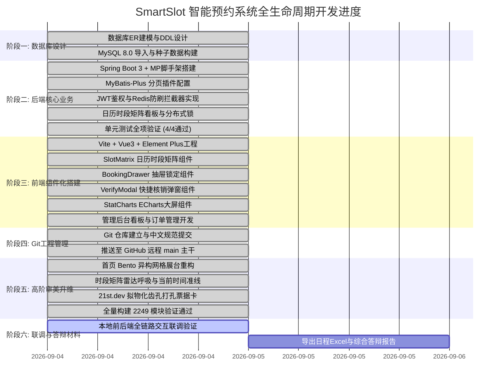

# SmartSlot 智能场地与时段预约系统开发计划与架构设计文档

## 一、 基本信息
- **项目名称**：SmartSlot 智能场地与时段预约系统
- **项目定位**：基于 Spring Boot 3 + MyBatis-Plus + Redis + MySQL + Vue 3 + Element Plus 的高可用时段预约与排课平台
- **建立时间**：2026-09-04 22:35
- **更新时间**：2026-09-04 22:50
- **当前状态**：全栈功能已跑通，五大核心技术要素落地，前端完成 Bento 异构网格与 21st.dev 拟物化票据卡高级动效重构，代码已持续同步推送到 GitHub 远程主干分支。
- **GitHub 仓库**：[https://github.com/liuGuanYi-hub/SmartSlot.git](https://github.com/liuGuanYi-hub/SmartSlot.git)

---

## 二、 核心需求与五大技术要素落地映射

| 规范要素 | 系统对应落地设计 | 详细技术方案 | 当前状态 |
| :--- | :--- | :--- | :---: |
| **1. 前端组件化开发** | `SlotMatrix.vue`<br>`BookingDrawer.vue`<br>`VerifyModal.vue`<br>`StatCharts.vue` | 封装日历时段矩阵网格，以行（09:00~22:00时段）、列（场馆各场地）网格化渲染；抽屉式预约确认；前台快捷 6 位核销码核验模态框；ECharts 营收与客流双轴走势及玫瑰图。 | ✅ 已完成 |
| **2. 拦截器 (Interceptor)** | `JwtAuthInterceptor`<br>`RateLimitInterceptor` | `JwtAuthInterceptor` 解析 Bearer Token 并在 ThreadLocal (`UserContext`) 中注入身份；`RateLimitInterceptor` 基于 Redis 原子递增对写操作接口实现 15 次/秒 防高频刷单拦截。 | ✅ 已完成 |
| **3. 分页插件使用** | MyBatis-Plus `PaginationInnerInterceptor` | 配置 `MybatisPlusInterceptor`，在用户端“我的预约列表”（多状态组合筛选）、管理端“场地管理”、“订单检索”全面接入物理分页。 | ✅ 已完成 |
| **4. 缓存与防超卖** | Redis / Caffeine 双模锁 (`LockManager`) | 核心预约接口使用 `slot:lock:{venueId}:{date}:{timeSlot}` 实施 15 分钟原子预占锁，超时自动释放，保障同一时段零冲突；支持本地缓存平滑降级。 | ✅ 已完成 |
| **5. 复杂表单交互** | JSR-303 表单校验 + 前端动态配置 | 注册表单（手机号正则/长度限制）、预约联系表单、场地发布表单（开放时段、单价、阶梯设施）、订单服务满意度打分评价表单。 | ✅ 已完成 |

---

## 三、 系统技术架构

### 1. 技术栈选型
- **后端架构**：
  - 核心框架：`Spring Boot 3.2.5` (兼容 Java 17/21/22)
  - 持久层：`MyBatis-Plus 3.5.6`
  - 数据库：`MySQL 8.0` (HikariCP 高性能连接池)
  - 缓存与锁：`Spring Data Redis` + `Caffeine Cache` 双模容灾
  - 鉴权认证：`JJWT 0.12.5`
  - 参数校验：`Hibernate Validator (JSR-303)`
  - 接口文档：`Knife4j 4.5.0`
- **前端架构**：
  - 构建工具：`Vite 5.2`
  - 视图框架：`Vue 3.4` (Composition API `<script setup>`)
  - 状态管理：`Pinia 2.1`
  - 路由管理：`Vue Router 4.3`
  - UI 组件库：`Element Plus 2.7` + `@element-plus/icons-vue`
  - 数据可视化：`ECharts 5.5`
  - 网络请求：`Axios 1.6` (带全局拦截器与 Token 注入)
  - 视觉审美：融入 **Landing.love**（呼吸流光）、**Land-book**（Bento 网格）、**21st.dev**（打孔票据卡）设计语言

---

## 四、 数据库表结构设计 (`smart_slot`)

1. **`sys_user` 用户表**：
   - 包含主键 `id`、登录名 `username`、密码 `password` (加盐加密)、昵称 `nickname`、手机号 `phone`、角色 `role` (`ROLE_USER`, `ROLE_ADMIN`)、虚拟余额 `balance`。
2. **`venue_category` 场地分类表**：
   - 包含主键 `id`、分类名称 `name`（羽毛球、篮球、网球、会议室）、图标 `icon`、排序权重 `sort`。
3. **`venue` 场地基础信息表**：
   - 包含主键 `id`、所属分类 `category_id`、名称 `name`、每小时单价 `price_per_hour`、容纳人数 `capacity`、营业起止时段 `open_time`/`close_time`、设施标签 `facilities`、状态 `status`。
4. **`booking_order` 预约订单表**：
   - 包含主键 `id`、业务流水号 `order_no`、用户 `user_id`、场地 `venue_id`、预约日期 `book_date`、时段 `time_slot`、金额 `total_amount`、订单状态 `order_status` (0:待支付锁定, 1:已预约待核销, 2:已核销, 3:已取消)、**6位数字核销码 `verify_code`**。
5. **`order_review` 服务评价表**：
   - 包含主键 `id`、订单 `order_id`、场地 `venue_id`、用户 `user_id`、星级打分 `rating` (1~5星)、评价文字 `content`。

---

## 五、 项目实施里程碑与动态进度甘特图



---

## 六、 高阶设计亮点归档

### 1. 首页 Bento 展台 (Land-book / siteinspire 灵感)
- 采用 **2/3 巨幕展卡** 展示羽毛球 1 号奥运场地，搭配 4.98 评分胶囊与全景视觉。
- 侧边搭配 **1/3 实时场馆利用率指标卡** 与 22℃ 恒温新风硬件承诺卡。

### 2. 时段矩阵微交互 (Landing.love 灵感)
- 顶部导航与时段状态栏加入**实时呼吸雷达点（`radarPulse` 动画）**。
- 日历矩阵增加**“当前真实小时指示标线”**，时段格子悬停贝塞尔微回弹（`scale(0.97)`）与霓虹辉光。

### 3. 拟物化数字入场票据卡 (21st.dev 灵感)
- 预约成功与订单详情提供**打孔齿孔票据卡（Ticket Stub）**。
- 6 位专属核销码采用荧光大字号等宽排版，支持**一键复制**。

---

## 七、 本地启动与联调说明

### 1. 后端启动
1. 确保 MySQL 8.0 服务正常运行，执行 `smart-slot-backend/sql/init.sql` 初始化数据库。
2. 在 `smart-slot-backend` 目录下执行：
   ```bash
   mvn spring-boot:run
   ```
3. 访问 Knife4j 接口文档：`http://localhost:8080/doc.html`

### 2. 前端启动
1. 在 `smart-slot-frontend` 目录下执行：
   ```bash
   npm run dev
   ```
2. 浏览器打开：`http://localhost:5173`
3. 演示账号：
   - 管理员：`admin` / `123456`
   - 普通会员：`user` / `123456`
